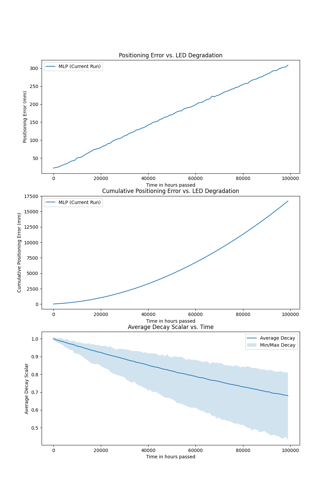

# VLP

# Prerequisites

This project was built with the following software installed:
- Python 3.13

# Get Started

In order to get started we need to install the requirements

## Create virtual environment (Optional)
```bash
$ python -m venv .venv
source .venv/bin/activate # .\.venv\Scripts\Activate.ps1 on Windows
```

## Install requirements
```bash
$ pip install -r requirements.txt
```

## Install RANSAC Line
In order to do line fitting, we use a custom line-fitting library so we have the same line fit in the simulator as in the embedded version. This line fitting can be found [here](https://github.com/einstein8612/ransac-line).

In order to install this, please follow the guide there or just copy paste these commands if you do not care about how it gets installed.

```bash
$ mkdir third_party
$ cd third_party
$ git clone git@github.com:einstein8612/ransac-line.git
$ cd ransac-line/bindings/python/ransac_line
$ pip install cffi setuptools
$ python build_ffi.py
$ cd ..
$ pip install .
$ cd ../../../..
```

## Data

To get started aqcuire the `mat_files` folder and store them in the dataset folder. Afterwards, run the script to translate them into a PyTorch set

```bash
$ python dataset/convert.py --src "./dataset/mat_files" --dst "./dataset/exported" --normalise true --training_fraction 0.8 --seed 42
```

This will generate the files

- `{dst}/data_{z}/train.csv`
- `{dst}/data_{z}/test.csv`
- `{dst}/data.csv`

In the given destination folder, where the first two are a split of the data grouped by z-pos, and the last is all the data in one CSV.

## Generate heat maps

In order to understand the quality of your cleaning solution or data augmentation solution, you can generate a heatmaps for every LED. Here every heatmap corresponds to the mean of all the values that are associated with that specific (x,y) coordinate.

This is also a necessary step if you want to clean or augment the data.

```bash
$ python dataset/heatmap.py --src "./dataset/exported/data.csv" --dst "./dataset/heatmaps" --imgs true
```

An example of such a heatmap is given here, for the non-cleaned data of LED 16 at `z=176`.


## TX Position extraction (Optional)

In order to make better use of cleaning and augmenting down the line, you may choose to estimate your TX locations through your data itself. It does this through a simple circle fitting method called [r3fit](https://github.com/einstein8612/r3fit/). In order to run this method, you can sue the following command:

```bash
$ python find_led_center.py --src "./dataset/heatmaps/heatmap_176/raw.npy" --min_sample 0.395 --max_sample 0.405 --imgs true
```

Here `min_sample` and `max_sample` decide which points are part of the circle to fit, essentially it means the thickness of the points to fit on. This command will output your estimated TX positions at `./leds/led_positions.json`. It will also optionally output images when you specify it. Here is an example:


You can clearly see the [r3fit](https://github.com/einstein8612/r3fit/) being much more noise resistant than Kasa, hence chosing it.

## Clean data

Afterwards, you can clean the data generated in the heatmaps with any of the following four, at the time of writing, strategies:

- MEAN
- IDW (Inverse Distance Weighing)
- LAMBERTIAN
- LAMBERTIAN-IDW (Inverse Distance Weighing)

It should be clear what they do: they replace invalid or noisy points using different methods. These include the mean of the nearest valid points, the inverse distance weighted sum of the nearest valid points, an estimated RSS based on the Lambertian model of the closest valid point, and an estimated RSS using the Lambertian model for the nearest valid points, weighted by their inverse distance.

In order to run them use the following command:

```bash
$ python dataset/clean.py --src {SRC} --dst {DST} --strategy {STRATEGY} --imgs {IMGS}
```

### Example (Lambertian IDW)

```bash
$ python dataset/clean.py --src "dataset/heatmaps/heatmap_176/raw.npy" --dst "dataset/heatmaps/heatmap_176" --strategy LAMBERTIAN-IDW --imgs true
```

Afterwards, your heatmaps will have been cleaned and images are stored in the destination folder under the name `led_{i}_cleaned_{STRATEGY}.png`

Again, an example of such a heatmap is given here for LED 16.


**Note**: In the actual output images, the raw version will not be plotted. This is simply to showcase the cleaning process, the actual output will be just the right sub-figure.

## Age data

In order to evaluate how well the model will perform after data ages and LEDs get replaced etc, we need a way to simulate aged data.

In this repository we provide this with the following command:
```bash
$ python dataset/led_age_simulation.py --src "./dataset/heatmaps/heatmap_176/cleaned_LAMBERTIAN-IDW.npy" --dst dataset/heatmaps/heatmap_176_aged --min_age 0 --max_age 100000 --r90_hours 33000 --imgs true
```

This constructs an aged heatmap, but uses random ages as specified by the range and the seed. In order to have fine-tuned control, you may overwrite these ages by using the ``--ages`` argument. The following is an example:
```bash
python dataset/led_age_simulation.py --src "./dataset/heatmaps/heatmap_176/cleaned_LAMBERTIAN-IDW.npy" --dst dataset/heatmaps/heatmap_176_aged --ages 1000 1000 1000 1000 1000 1000 1000 1000 1000 1000 1000 1000 1000 1000 1000 1000 1000 1000 1000 1000 1000 1000 1000 1000 1000 1000 1000 1000 1000 1000 1000 1000 1000 1000 1000 1000 --r90_hours 33000 --imgs true
```

You can also generate a time-series of data points, which can simulate the model receiving data as the LEDs are aging. This allows for a more finetuned response to the LED degradation problem. You can use the following command to generate this dataset:

```bash
$ python dataset/led_age_series.py --src "./dataset/heatmaps/heatmap_176/cleaned_LAMBERTIAN-IDW.npy" --dst dataset/exported/age-series --timestep 100 --time 50000
```

## Heatmaps to datasets

In order to use cleaned and/or augmented heatmaps in an experiment you need to turn it into a dataset. You can do this by running the following command:
```bash
$ python dataset/heatmap_to_dataset.py --src "dataset/heatmaps/heatmap_176/cleaned_LAMBERTIAN-IDW.npy" --dst "dataset/exported/data_176_cleaned" --seed 42
```

## Run experiment (Training)

In order to test this data's efficiency at generating positions, we can run experiments with the following command:

```bash
$ python experiment.py --task {TASK} --dataset {DATASET} --seed {SEED}
```

### Example (RF)

```bash
$ python experiment.py --task "RF-TINY" --dataset "./dataset/exported/data_176" --seed 42
# ...
# Model saved to saved_runs/RF-TINY-1745593383.pickle
# Average error: 24.283416141929006
```

## (Re?)Run experiment (From trained model)

In order to be repeatable, we can used the saved run to predict the average error again.

```bash
$ python experiment.py --task {TASK} --dataset {DATASET} --load {SAVED_RUN} --seed {SEED}
```

### Example (RF)

```bash
$ python experiment.py --task "RF-TINY" --dataset "./dataset/exported/data_176" --load "./saved_runs/RF-TINY-1745593383.pickle" --seed 42
# ...
# Average error: 24.283416141929006
```

## CUDA/ROCm

If you want to use your GPU to accelerate training, then pass the device parameter as follows:

```bash
$ python experiment.py --task {TASK} --dataset {DATASET} --device {DEVICE} --seed {SEED}
```

### Example (MLP)

```bash
$ python experiment.py --task "MLP" --dataset "./dataset/exported/data_176" --device "cuda:0" --seed 42
# ...
# Average error: 6.804797172546387
```

## Run timeseries experiment

In order to test our solution over a period of time where LEDs may dim, we can use the simulator provided in `experiment_timeseries.py`. A minimal example is found below. Please consult the source code if you need to tweak further.

```bash
$ python experiment_timeseries.py --task "MLP-TINY" --load_model "./saved_runs/MLP-TINY-1748798043.pth" --src ./dataset/heatmaps/heatmap_176/cleaned_LAMBERTIAN-IDW.npy --timestep 1000 --time 100000 --seed 42
```

This will generate a saved run at `./saved_timeseries_runs/MLP-TINY-{TIMESTAMP}`, where you can find the following files. The `results.json` will contain all reproducability parameters, as well as the errors and decays in arrays. This is useful for making figures afterwards manually. It will also give you a figure where you can see the (cumulative) error positioning error, as well as the minimum, average and maximum decay scalar at every timestep. An example can be seen below:



### Comparison

If you want to compare to other solutions, you can make use of the built in compare mode. This allows for n other runs to be displayed in our error graph. The following command demonstrates using it:

```bash
$ python experiment_timeseries.py --task "MLP-ONLINE-TINY" --load_model "./saved_runs/MLP-ONLINE-TINY-1748798403.pth" --src ./dataset/heatmaps/heatmap_176/cleaned_LAMBERTIAN-IDW.npy --timestep 1000 --time 100000 --seed 42 --compare-to "./saved_timeseries_runs/MLP-TINY-1748798275" "./saved_timeseries_runs/MLP-TINY-NORMALISE-1748798493"
```

